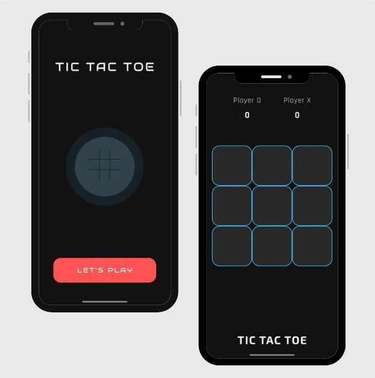

# 🕹️ Tic Tac Toe - Flutter App

A sleek and simple **Tic Tac Toe** game built with **Flutter**, designed for smooth gameplay, minimalistic UI, and offline fun. This is a local multiplayer game (2 players on the same device), built using clean Dart logic and Flutter widgets.

---

## ✨ Features

- 🔁 Classic Tic Tac Toe (X-O) game
- 👥 2-player mode (same device)
- 💡 Clear turn indicators and win/draw messages
- 🎨 Minimal UI using custom fonts (`Exo2`, `Rajdhani`)
- 🚫 No ads, no internet required
- 🧠 Simple but effective game logic

---

## 📸 Screenshots

| Images | 
|------------|
|  | 

---

## 🚀 Getting Started

### ✅ Requirements

- Flutter SDK (v3.10+ recommended)
- Dart SDK
- Emulator or physical device

### 🔧 Installation

```bash
git clone https://github.com/rly09/flutter-tic-tac-toe.git
cd flutter-tic-tac-toe
flutter pub get
flutter run
```
